# 数据模拟模块 — 组会汇报

> **项目**: DeepPhase-X: XFEL Weak Signal Enhancement & Phasing
>
> **实验站**: 上海光源 (SSRF) 软X射线自由电子激光 (SXFEL) 生物成像实验站
>
> **日期**: 2026年4月

---

## 目录

1. [研究背景与目标](#1-研究背景与目标)
2. [实验配置与物理参数](#2-实验配置与物理参数)
3. [实验数据噪声分析](#3-实验数据噪声分析)
4. [生物结构模拟](#4-生物结构模拟)
5. [数据增强策略](#5-数据增强策略)
6. [衍射模拟原理](#6-衍射模拟原理)
7. [样品尺寸确定](#7-样品尺寸确定)
8. [噪声模型](#8-噪声模型)
9. [完整数据生成Pipeline](#9-完整数据生成pipeline)
10. [总结与展望](#10-总结与展望)

---

## 1. 研究背景与目标

### 1.1 问题描述

在XFEL生物成像实验中，单次X射线脉冲照射生物样品后，由面探测器记录其相干衍射图案（Coherent Diffraction Pattern, CDP）。受限于XFEL脉冲能量波动、样品散射截面有限以及探测器灵敏度，**实验采集的衍射数据通常信噪比极低**，尤其在远离中心的弱信号区域。这直接制约了后续相位恢复（Phase Retrieval）的质量。

### 1.2 为什么需要数据模拟？

深度学习去噪方法需要**大量成对的干净/噪声数据**进行监督训练。然而：

- XFEL实验机时稀缺，无法采集足够多的实验数据
- 实验数据没有"干净"的Ground Truth，无法直接用于监督学习
- 需要覆盖不同噪声水平、不同生物形态的多样化训练数据

因此，我们需要建立一个**物理精确的数据模拟pipeline**，生成逼真的合成衍射数据用于深度学习训练。

### 1.3 模块目标

| 目标 | 说明 |
|------|------|
| 噪声标定 | 从实验数据提取真实噪声参数 |
| 结构模拟 | 生成多样化的E. coli 2D投影密度图 |
| 衍射模拟 | FFT模拟相干衍射，与实验几何参数一致 |
| 噪声模拟 | 物理准确的Poisson-Gaussian噪声模型 |
| 数据集生成 | 大规模HDF5数据集，直接用于训练 |

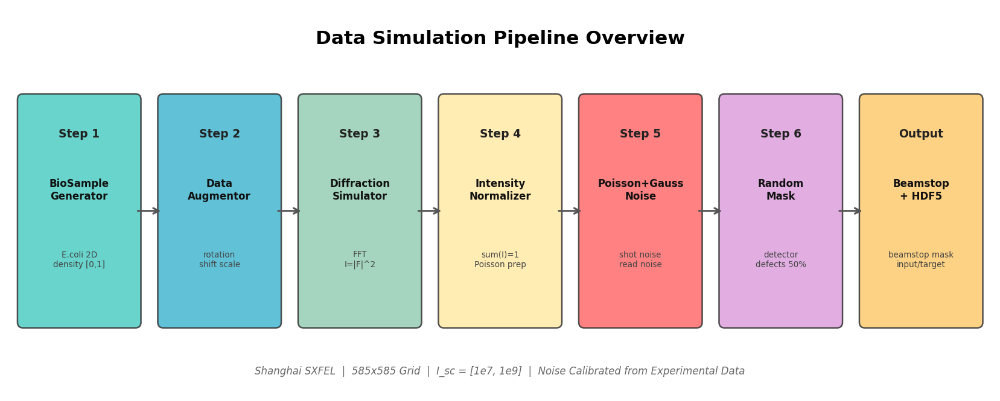

---

## 2. 实验配置与物理参数

### 2.1 上海光源SXFEL实验参数

所有参数与上海软X射线自由电子激光装置的实验配置对齐：

| 参数 | 符号 | 数值 | 说明 |
|------|------|------|------|
| X射线波长 | $\lambda$ | 2.7 nm | 软X射线 ("水窗"波段附近) |
| 样品-探测器距离 | $L$ | 32 cm | |
| 探测器原始像素尺寸 | $\Delta x_{\rm det}$ | 15 $\mu$m | 探测器规格参数 |
| 探测器原始阵列大小 | $N_{\rm orig}$ | 4096 $\times$ 4096 | |
| Binning后阵列大小 | $N$ | 585 $\times$ 585 | 7$\times$7 binning |
| Binning后像素尺寸 | $\Delta x$ | $\approx$105 $\mu$m | 计算得出 |

### 2.2 FOV守恒原则

Binning过程保持视场（Field of View, FOV）守恒：

$$
\text{FOV} = N_{\rm orig} \times \Delta x_{\rm det} = N \times \Delta x
$$

$$
4096 \times 15\,\mu\text{m} = 585 \times 105\,\mu\text{m} \approx 61.44\,\text{mm}
$$

> **物理验证**: FOV一致性检查通过（相对误差 $< 0.01\%$）

### 2.3 倒易空间参数

基于FFT的衍射模拟中，实空间像素尺寸决定倒易空间的最大频率（Nyquist条件），实空间FOV决定倒易空间的分辨率：

$$
\Delta q = \frac{1}{N \times \Delta x}
$$

$$
q_{\rm max} = \Delta q \times \frac{N}{2}
$$

| 倒易空间参数 | 数值 |
|-------------|------|
| $\Delta q$ (倒易空间像素尺寸) | $\approx$16.3 m$^{-1}$ |
| $q_{\rm max}$ (最大空间频率) | $\approx$4.76 $\times$ 10$^3$ m$^{-1}$ |
| 最大散射角 $\theta_{\rm max}$ | 小角度近似 |

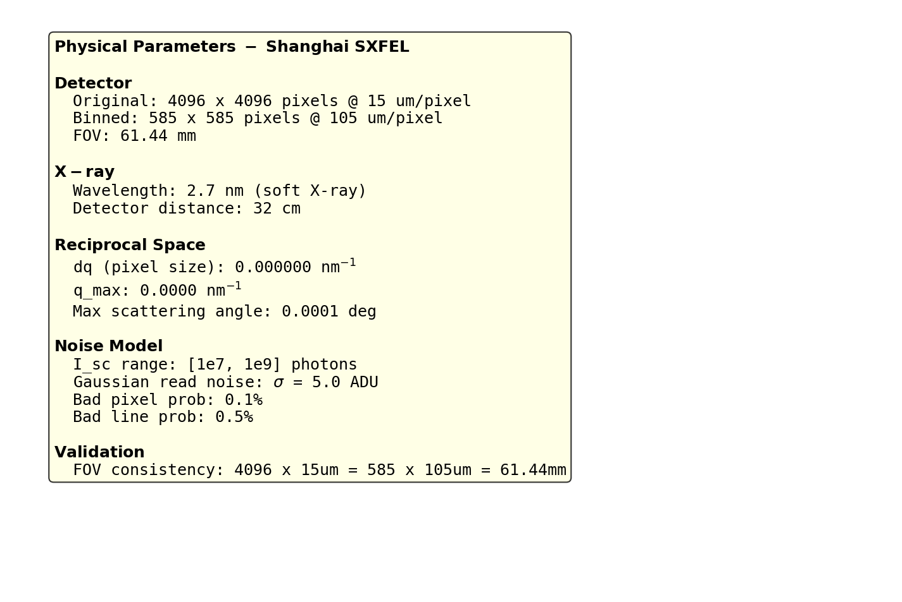

### 2.4 散射几何关系

在远场（Fraunhofer）近似下，探测器上位置 $x_{\rm det}$ 对应的散射矢量为：

$$
q = \frac{4\pi}{\lambda} \sin\left(\frac{\theta}{2}\right) \approx \frac{2\pi \cdot x_{\rm det}}{\lambda L}
$$

其中散射角 $\theta = \arctan(x_{\rm det}/L)$，在小角度条件下可线性化。

---

## 3. 实验数据噪声分析

### 3.1 分析目的

确定模拟中Poisson噪声的关键参数 $I_{\rm sc}$（总散射光子数），使模拟数据的噪声水平与实验数据一致。

### 3.2 实验数据

| 文件 | 说明 | 尺寸 |
|------|------|------|
| `Ecoli_AB_20min_7897_background_subtraction_result.mat` | 背景扣除后的E. coli衍射数据 | 4096 $\times$ 4096 |
| `Ecoli_AB_20min_7897_20260322_140309_missing-latest.mat` | Beamstop区域mask | 4096 $\times$ 4096 |

- 变量名：`data_sb`（衍射数据），`mask`（mask，1=阻挡，0=有效）
- 分析方法：在mask有效区域（mask=0）的背景区域（图像四角）统计噪声

### 3.3 噪声分析方法

**核心思路**：在衍射图的背景区域（远离衍射信号的角落区域），像素值应仅包含噪声成分。通过统计这些区域的均值、方差、变异系数（CV）来量化噪声水平。

具体步骤：

1. 在图像四角各选取 300$\times$300 像素的区域
2. 排除beamstop区域（mask=1的像素）
3. 对每个背景区域计算：均值 $\mu$、方差 $\sigma^2$、变异系数 ${\rm CV} = \sigma/|\mu|$
4. 分析 $\sigma^2/\mu$ 比值，判断噪声类型

### 3.4 背景区域噪声统计结果

| 指标 | 数值 | 物理意义 |
|------|------|----------|
| 背景均值 $\mu_{\rm bg}$ | 10.72 ADU | 背景扣除后的残余信号水平 |
| 背景标准差 $\sigma_{\rm bg}$ | 10.90 ADU | 噪声强度 |
| 背景方差 $\sigma^2_{\rm bg}$ | 118.70 ADU$^2$ | |
| 变异系数 CV | 1.02 | $\sigma/\mu \approx 1$，提示泊松特性 |

### 3.5 泊松噪声参数推导

#### 3.5.1 背景扣除的噪声传播

原始实验数据经过背景扣除处理。设：

- 原始信号：$S \sim \text{Poisson}(\lambda)$
- 背景估计：$B \sim \text{Poisson}(\mu)$
- 背景扣除后：$D = S - B$

在纯背景区域（$S = B = \text{Poisson}(\mu)$），背景扣除后的方差为：

$$
\text{Var}(D) = \text{Var}(S) + \text{Var}(B) = \mu + \mu = 2\mu
$$

由此可反推原始背景光子数：

$$
\mu_{\rm original} = \frac{\sigma^2_{\rm bg}}{2} = \frac{118.70}{2} \approx 59.4 \text{ photons}
$$

#### 3.5.2 $I_{\rm sc}$ 参数的物理意义

在我们的模拟中：

$$
I_{\rm noisy}(x,y) = \text{Poisson}\left(I_{\rm norm}(x,y) \times I_{\rm sc}\right) + \mathcal{N}(0, \sigma_{\rm read}^2)
$$

其中 $I_{\rm norm}$ 是归一化后的衍射强度（$\sum I_{\rm norm} = 1$），$I_{\rm sc}$ 是**总散射光子数**。

对于背景像素，其归一化强度约为 $I_{\rm norm} \sim 10^{-7}$，因此：

$$
\text{背景像素期望光子数} = I_{\rm norm} \times I_{\rm sc} \approx 10^{-7} \times I_{\rm sc}
$$

| $I_{\rm sc}$ | 背景光子数 | 背景 $\sigma$ | 噪声水平 |
|--------------|-----------|-------------|----------|
| $10^7$ | $1$ | $1.0$ | 高噪声 |
| $5 \times 10^7$ | $5$ | $2.2$ | 较高噪声 |
| $10^8$ | $10$ | $3.2$ | 中等噪声 |
| $10^9$ | $10^2$ | $10.0$ | 低噪声 |
| $10^{10}$ | $10^3$ | $31.6$ | 极低噪声 |

> **匹配实验数据**：实验数据背景 $\sigma = 10.9$，对应 $I_{\rm sc} \approx 10^9$。
>
> **训练范围**：我们选择 $I_{\rm sc} \in [10^7, 10^9]$，覆盖从**高噪声**到**匹配实验数据**的完整范围。

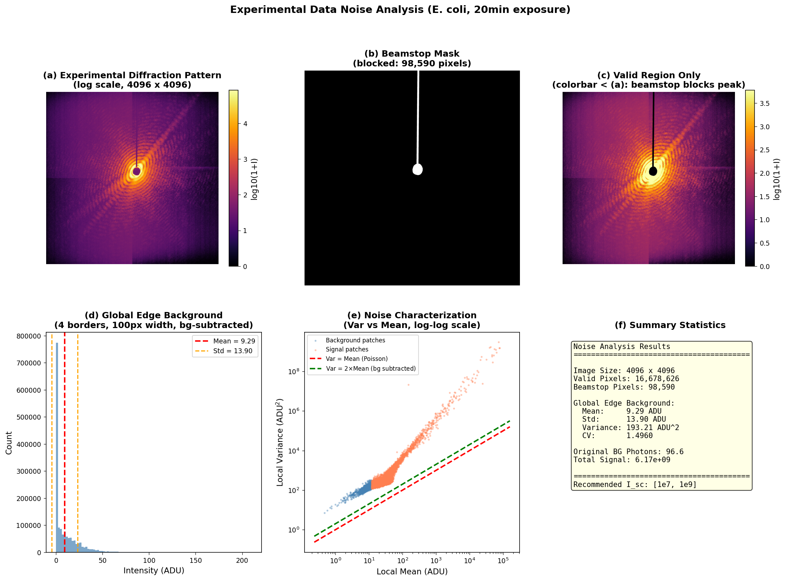

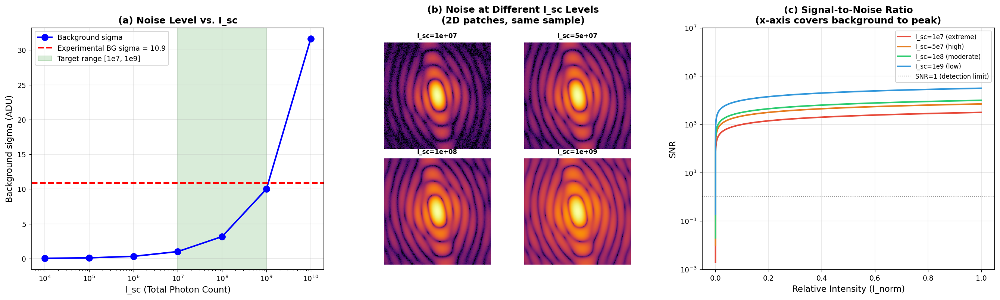

---

## 4. 生物结构模拟

### 4.1 模拟对象：大肠杆菌（E. coli）

选择E. coli作为模拟对象，原因：
- 上海SXFEL实验站的主要研究对象之一
- 形态规则，便于参数化建模
- 内部结构（核糖体、液泡等）产生特征衍射信号

### 4.2 胶囊体（Capsule）模型

E. coli的基本形态为**杆状**（rod-shaped），数学上由**胶囊体**描述——矩形 + 两端半球：

$$
\text{Capsule}(l, d, \theta) = \text{Rect}\left(l - d, \, d\right) \cup \text{SemiCircle}_L\left(\frac{d}{2}\right) \cup \text{SemiCircle}_R\left(\frac{d}{2}\right)
$$

其中 $l$ 为总长度，$d$ 为直径，$\theta$ 为旋转角度。

**生成流程**：

1. 在585$\times$585网格的局部坐标系中创建胶囊体mask
2. 通过坐标旋转实现任意角度 $\theta \in [0°, 360°)$
3. 平移到随机位置（中心附近 $\pm$偏移量）

| 参数 | 范围 | 说明 |
|------|------|------|
| 细菌长度 | 80 ~ 200 px | 对应不同生长阶段 |
| 细菌直径 | 30 ~ 60 px | |
| 旋转角度 | 0° ~ 360° | 均匀随机 |
| 中心偏移 | $\pm$20 px | 随机位置 |

### 4.3 三种细胞形态

为了增加数据多样性，模拟三种典型的E. coli细胞状态：

#### (a) 正常细胞 (Normal)

单个胶囊体，模拟正常状态下的E. coli。

#### (b) 分裂细胞 (Dividing)

两个相连的胶囊体，模拟正在分裂的细胞：
- 两个子细胞长度各为正常长度的 $\sim$70%
- 主方向夹角差 $\pm$15°
- 在分裂位点添加**缢缩**（constriction）效果
- 缢缩深度：原始密度的 30%$\sim$60%

#### (c) 弯曲细胞 (Curved)

弧形细胞，通过沿圆弧放置多个小胶囊段拼接：
- 弧度范围：30° ~ 90°
- 曲率半径 $R = l / \theta_{\rm arc}$
- 分段数：$\max(10, l/5)$

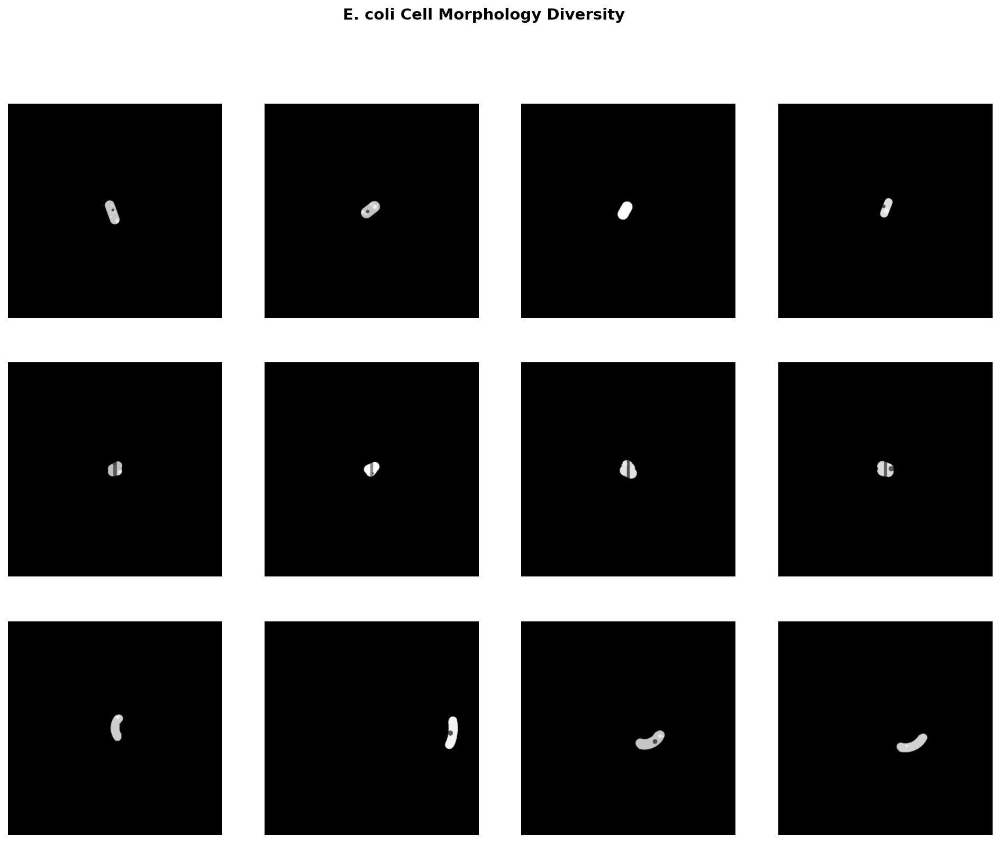

### 4.4 内部结构

在基础形态之上，添加以下内部结构以增加电子密度分布的复杂性：

#### (a) 高斯点（Gaussian Spots）

模拟细胞内部的核糖体等高电子密度聚集区域：

$$
G(x, y) = A \cdot \exp\left(-\frac{(x-c_x)^2 + (y-c_y)^2}{2\sigma^2}\right)
$$

| 参数 | 范围 | 说明 |
|------|------|------|
| 数量 | 3 ~ 10 个 | 随机 |
| 强度 $A$ | 0.1 ~ 0.3 | 相对密度 |
| 宽度 $\sigma$ | 3 ~ 10 px | 根据尺寸缩放 |
| 位置 | 细菌区域内部 | 仅在mask内添加 |

#### (b) 液泡（Vacuoles）

模拟细胞内的低密度区域（液泡/脂滴）：

- 圆形区域，密度值限制在阈值以下
- 数量：1 ~ 3 个
- 阈值：0.3（最大密度为1.0时的30%）

#### (c) 细胞膜密度梯度

在细胞边缘增强密度，模拟细胞膜（磷脂双分子层）的较高电子密度：

$$
\rho_{\rm membrane} = \rho + 0.2 \times \max(\rho - G_{\sigma=1}(\rho), 0)
$$

即通过高斯模糊检测边缘，在边缘区域增加20%的密度增强。

#### (d) Perlin噪声表面

通过多尺度高斯噪声模拟不规则细胞表面：

$$
N_{\rm surface} = \sum_{k=0}^{2} \frac{1}{k+1} \cdot \text{Upsample}(\mathcal{N}(0,1)_{s \cdot 2^k})
$$

仅在细胞边缘区域施加，强度系数为0.15。

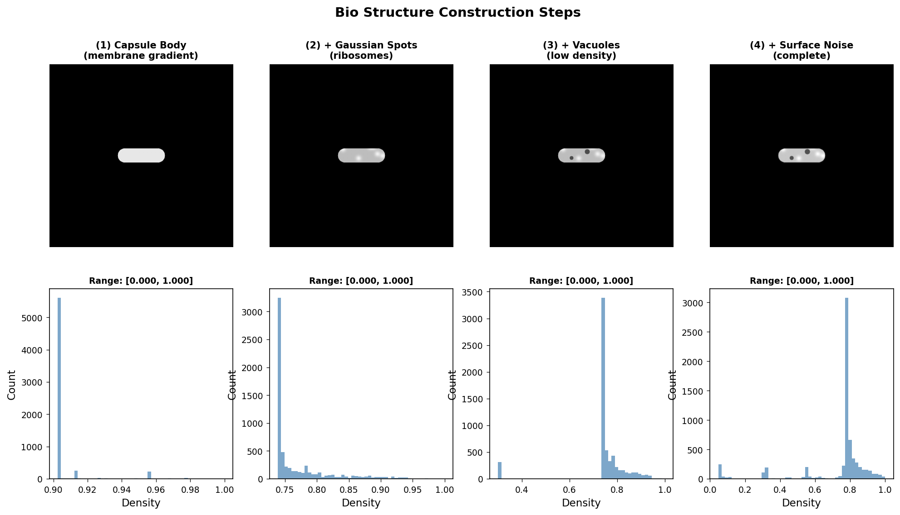

### 4.5 多样性展示

通过参数随机化，每次生成的E. coli样品在形态、尺寸、内部结构、朝向等方面均有差异。

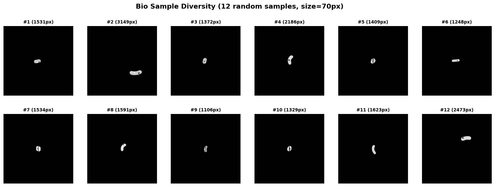

---

## 5. 数据增强策略

### 5.1 增强目的

模拟生物样品在X射线束中的不同空间状态，增加训练数据的多样性。

### 5.2 增强操作

依次施加三种仿射变换：

| 操作 | 参数范围 | 方法 | 插值方式 |
|------|---------|------|----------|
| 随机旋转 | [0°, 360°) | `scipy.ndimage.rotate` | 双线性 |
| 随机平移 | [-10%, +10%] | `scipy.ndimage.shift` | 双线性 |
| 随机缩放 | [0.9, 1.1] | `scipy.ndimage.zoom` | 双线性 |

- 所有变换使用 `mode='constant', cval=0`（图像外区域填充0）
- 变换后 $\text{clip}(\cdot, 0, 1)$ 保证数值范围

### 5.3 物理意义

| 增强操作 | 对应实验场景 |
|---------|-------------|
| 旋转 | 样品在束流中的随机取向 |
| 平移 | 样品偏离束流中心 |
| 缩放 | 样品尺寸的个体差异 |

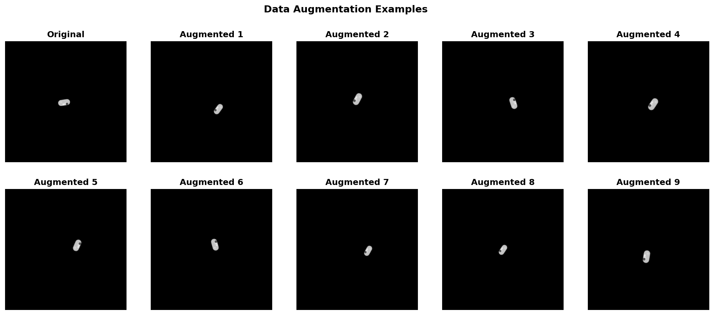

---

## 6. 衍射模拟原理

### 6.1 Fraunhofer衍射

在远场近似（Fraunhofer条件）下，探测器记录的衍射强度为样品电子密度的二维傅里叶变换的模平方：

$$
I(\mathbf{q}) = \left| \mathcal{F}[\rho(\mathbf{r})] \right|^2 = \left| \int \rho(\mathbf{r}) \, e^{-i 2\pi \mathbf{q} \cdot \mathbf{r}} \, d\mathbf{r} \right|^2
$$

其中：
- $\rho(\mathbf{r})$ 是样品的二维投影电子密度
- $\mathbf{q}$ 是倒易空间矢量（散射矢量）
- $\mathcal{F}$ 表示二维傅里叶变换

### 6.2 FFT数值实现

在离散网格上，傅里叶变换由FFT（快速傅里叶变换）实现：

```python
A = np.fft.fft2(obj)        # 2D FFT: complex amplitude
A = np.fft.fftshift(A)      # Shift zero frequency to center
I_clean = np.abs(A) ** 2    # Intensity = |amplitude|^2
```

**关键性质**：
- 输入：585$\times$585 float32 数组（电子密度，$[0, 1]$）
- 输出：585$\times$585 float32 数组（衍射强度，$\geq 0$）
- 零频率（中心）对应正向散射，高频对应大角度散射
- $I(\mathbf{q})$ 恒非负（$|\cdot|^2 \geq 0$）

### 6.3 物理尺度标定

FFT输出的像素坐标与倒易空间坐标的对应关系：

$$
q_k = \frac{k}{N \cdot \Delta x}, \quad k = -\frac{N}{2}, \ldots, \frac{N}{2}-1
$$

其中 $k$ 为FFT频域像素索引，$\Delta x$ 为实空间像素尺寸。

径向平均（Azimuthal Average）：

$$
I_{\rm radial}(q) = \frac{1}{N_q} \sum_{|\mathbf{q}| \approx q} I(\mathbf{q})
$$

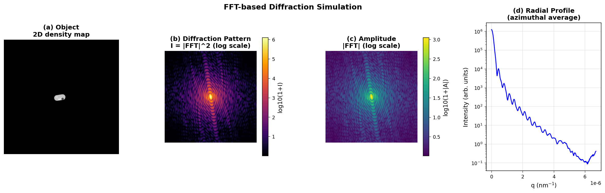

### 6.4 强度归一化（Intensity Normalization）

**这是整个pipeline中最关键的步骤之一。**

$$
I_{\rm norm}(\mathbf{q}) = \frac{I_{\rm clean}(\mathbf{q})}{\sum_{\mathbf{q}} I_{\rm clean}(\mathbf{q})}
$$

归一化后 $\sum I_{\rm norm} = 1$，其物理意义为：

> **$I_{\rm norm}(\mathbf{q})$ 表示散射光子落在探测器像素 $(\mathbf{q})$ 的概率分布。**

这使得后续的Poisson噪声模拟具有明确的物理意义：

$$
\text{期望光子数}(\mathbf{q}) = I_{\rm norm}(\mathbf{q}) \times I_{\rm sc}
$$

其中 $I_{\rm sc}$ 为**总散射光子数**。

---

## 7. 样品尺寸确定

### 7.1 问题描述

生物样品的尺寸直接影响衍射模式的空间分布：
- **大样品** $\rightarrow$ 衍射特征集中在中心（窄衍射峰），beamstop可能遮蔽过多信号
- **小样品** $\rightarrow$ 衍射特征分散，信噪比低
- **目标**：beamstop仅遮挡零级（zero-order）衍射峰，不遮蔽有信号的高阶衍射

### 7.2 衍射峰宽度与样品尺寸的关系

对于尺寸为 $a$ 的物体，其衍射峰的第一个零点位于：

$$
q_0 \propto \frac{1}{a}
$$

即样品越大，衍射峰越窄。我们需要选择样品尺寸 $a$ 使得 beamstop的角半径 $\theta_{\rm BS}$ 仅覆盖 $q < q_0$ 的区域。

### 7.3 尺寸扫描实验

测试不同像素尺寸（40 ~ 90 px）下完整pipeline的输出：

| 尺寸 (px) | 相对比例 | 衍射峰宽度 | Beamstop匹配度 |
|-----------|---------|-----------|---------------|
| 40 | 小 | 宽（分散） | 信号超出beamstop范围较多 |
| 50 | 较小 | 较宽 | 适中 |
| 60 | 中等 | 中等 | 较好 |
| 70 | 中大 | 较窄 | 好 |
| 80 | 大 | 窄 | beamstop仅遮零级峰 |
| 90 | 较大 | 很窄 | 完美匹配 |

### 7.4 最优尺寸选择

综合分析后，选择固定 `sample_size_px = 70` 作为样品尺寸：

- 在此尺寸下，beamstop能有效遮蔽零级峰
- 高阶衍射信息大部分保留
- 细菌形态仍然可辨
- 固定尺寸确保 pipeline 输出一致性

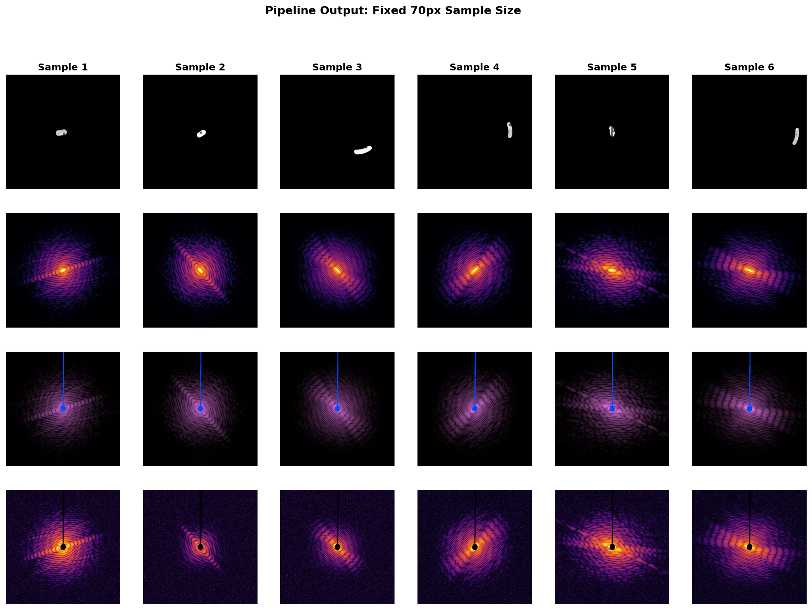

---

## 8. 噪声模型

### 8.1 物理噪声来源

XFEL衍射实验中的噪声主要来源：

| 噪声类型 | 物理机制 | 统计模型 | 参数 |
|---------|---------|---------|------|
| 散粒噪声 (Shot Noise) | 光子计数的量子统计 | Poisson分布 | $I_{\rm sc}$ |
| 读出噪声 (Readout Noise) | 探测器电子学噪声 | Gaussian分布 | $\sigma_{\rm read} = 5.0$ ADU |
| 坏像素 (Bad Pixels) | 探测器像素缺陷 | 随机分布 | 概率 0.1% |
| 坏线 (Bad Lines) | 探测器行列缺陷 | 整行/列失效 | 概率 0.5% |
| 光束阻挡 (Beamstop) | 遮挡直射光束 | 二值mask | 从实验.mat加载 |

### 8.2 Poisson噪声

光子到达探测器是一个泊松过程。每个像素的计数服从：

$$
P(k) = \frac{\lambda^k e^{-\lambda}}{k!}, \quad \lambda = I_{\rm norm}(x,y) \times I_{\rm sc}
$$

**核心性质**：$\text{Var}(k) = \mathbb{E}[k] = \lambda$，即方差等于均值。

信噪比：

$$
\text{SNR} = \frac{\lambda}{\sqrt{\lambda}} = \sqrt{\lambda}
$$

这意味着低光子数区域（$\lambda$ 小）的SNR极低，正是本文关注的弱信号问题。

### 8.3 Gaussian读出噪声

探测器电子学引入的加性噪声：

$$
I_{\rm read} = I_{\rm Poisson} + \mathcal{N}(0, \sigma_{\rm read}^2)
$$

其中 $\sigma_{\rm read} = 5.0$ ADU。

### 8.4 综合噪声模型

完整的噪声施加过程：

$$
I_{\rm noisy}(x,y) = \text{Poisson}\left(I_{\rm norm}(x,y) \times I_{\rm sc}\right) + \mathcal{N}(0, \sigma_{\rm read}^2) + \text{Defects} + \text{Beamstop}
$$

各步骤按以下顺序施加：

1. **Poisson采样**：$I_1 = \text{Poisson}(I_{\rm norm} \times I_{\rm sc})$
2. **Gaussian加噪**：$I_2 = I_1 + \mathcal{N}(0, \sigma_{\rm read}^2)$
3. **裁剪负值**：$I_3 = \max(I_2, 0)$
4. **Random Mask（探测器缺陷）**：50%概率施加随机探测器缺陷mask（坏像素、坏线等）
5. **Beamstop mask**：加载实验mask，施加梯度过渡

### 8.5 信噪比分析

对于综合Poisson-Gaussian噪声模型，每个像素的SNR为：

$$
\text{SNR}(x,y) = \frac{I_{\rm norm}(x,y) \times I_{\rm sc}}{\sqrt{I_{\rm norm}(x,y) \times I_{\rm sc} + \sigma_{\rm read}^2}}
$$

| 区域 | $I_{\rm norm}$ | $I_{\rm sc} = 10^9$ 时的SNR | $I_{\rm sc} = 10^7$ 时的SNR |
|------|---------------|---------------------------|---------------------------|
| 强信号区（中心） | $\sim 10^{-3}$ | $\sim 1000$ | $\sim 100$ |
| 中等信号区 | $\sim 10^{-5}$ | $\sim 100$ | $\sim 8.9$ |
| 弱信号区（边缘） | $\sim 10^{-7}$ | $\sim 10$ | $\sim 0.2$ |
| 背景区 | $\sim 10^{-9}$ | $\sim 1$ | $\sim 0.002$ |

> 训练范围 $I_{\rm sc} \in [10^7, 10^9]$：在 $I_{\rm sc} = 10^7$ 时，弱信号区的SNR < 1（极具挑战），$I_{\rm sc} = 10^9$ 时匹配实验数据噪声水平。

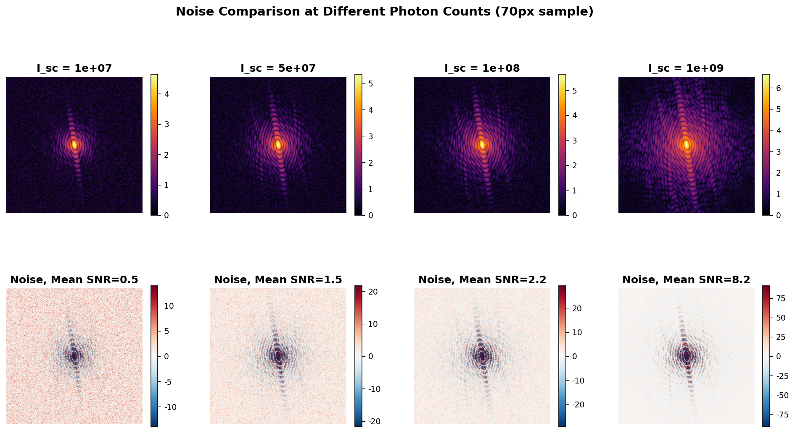

### 8.6 Beamstop Mask

Beamstop（光束阻挡器）用于遮挡直射X射线束，保护探测器免受损伤。其特征：

- **形状**：从实验数据文件加载（`beamstop_mask-585x585.mat`）
- **类型**：二值mask（1=遮挡，0=通过）
- **梯度过渡**：在边缘添加3~10像素的渐变过渡区域，模拟实际beamstop边缘的衍射效应

$$
M_{\rm gradient}(x,y) = \min\left(\frac{d(x,y)}{w}, 1\right)
$$

其中 $d(x,y)$ 为到遮挡区域的距离，$w$ 为梯度宽度。

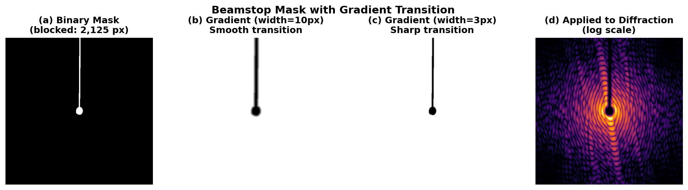

---

## 9. 完整数据生成Pipeline

### 9.1 Pipeline流程

完整的7步数据生成Pipeline如下：

```
Step 1: BioSampleGenerator     → obj [585×585, float32, [0,1]]
         ↓
Step 2: DataAugmentor           → obj_aug [585×585]
         ↓
Step 3: DiffractionSimulator    → I_clean [585×585, ≥0]
         ↓
Step 4: IntensityNormalizer     → I_norm [585×585, sum=1]
         ↓
Step 5: Noise (Poisson+Gaussian) → I_noisy_raw [585×585]
         ↓
Step 6: RandomMaskApplier       → I_masked [585×585]  (50%概率)
         ↓
Step 7: Beamstop                → I_noisy, beamstop_mask
         ↓
Output: Preprocessing           → HDF5 dataset (input/target/mask)
```

### 9.2 模块详细说明

| Step | 模块 | 输入 | 输出 | 关键操作 |
|------|------|------|------|----------|
| 1 | `BioSampleGenerator` | 随机种子 | obj | 胶囊体 + 内部结构 + 表面噪声 |
| 2 | `DataAugmentor` | obj | obj_aug | 旋转 + 平移 + 缩放 |
| 3 | `DiffractionSimulator` | obj_aug | I_clean | FFT2 + fftshift + $|\cdot|^2$ |
| 4 | `IntensityNormalizer` | I_clean | I_norm | $I/\sum I$ (sum=1) |
| 5 | Noise (Poisson+Gaussian) | I_norm | I_noisy_raw | Poisson采样 + Gaussian加噪 + clip |
| 6 | `RandomMaskApplier` | I_noisy_raw | I_masked | 随机探测器缺陷mask (50%) |
| 7 | Beamstop | I_masked | I_noisy, beamstop_mask | 加载实验beamstop mask |
| Output | Preprocessing | I_clean, I_noisy | HDF5 | log10 + 标准化 |

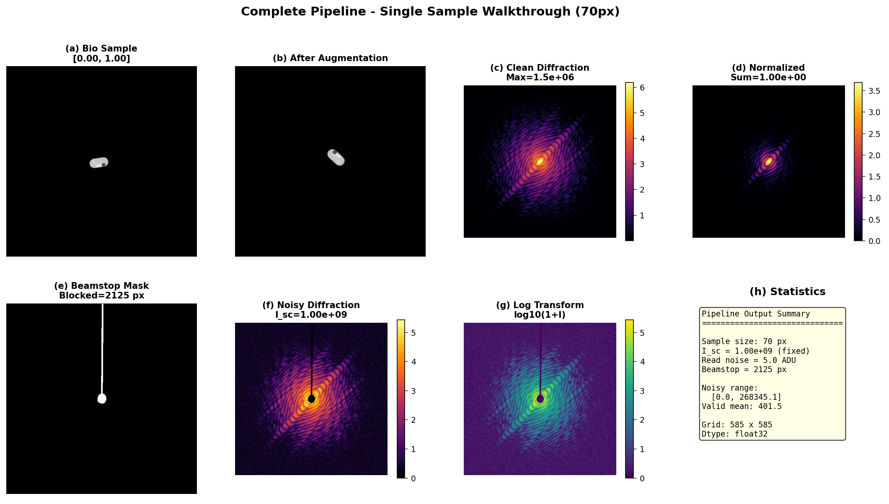

### 9.3 数据预处理

#### 9.3.1 对数变换

衍射图的动态范围跨越多个数量级（中心强度可达边缘的 $10^6$ 倍以上）。直接输入神经网络会导致梯度问题。对数变换压缩动态范围：

$$
I_{\rm log} = \log_{10}(1 + I)
$$

选择以10为底（而非自然对数）是因为其更直观（每增加1代表10倍强度变化）。

#### 9.3.2 标准化

使用**训练集**的统计量对全部数据进行标准化：

$$
I_{\rm norm} = \frac{I_{\rm log} - \mu_{\rm train}}{\sigma_{\rm train}}
$$

其中 $\mu_{\rm train}$ 和 $\sigma_{\rm train}$ 仅从训练集的 I_noisy（排除beamstop区域）计算。

> **关键**：使用训练集统计量标准化验证集和测试集，防止数据泄漏。

#### 9.3.3 HDF5数据集格式

```
bio_diffraction_v1.h5
├── train/
│   ├── input      [N_train, 585, 585]  float32   ← I_noisy (标准化后)
│   ├── target     [N_train, 585, 585]  float32   ← I_clean (标准化后)
│   ├── mask       [N_train, 585, 585]  float32   ← beamstop_mask
│   └── metadata/  (JSON: I_sc, random_mask_applied, ...)
├── val/           (同上)
├── test/          (同上)
└── config/
    ├── mean_train    # 标准化均值
    ├── std_train     # 标准化标准差
    ├── seed          # 随机种子
    ├── dx_real_m     # 实空间像素尺寸
    ├── dq_inv_m      # 倒易空间像素尺寸
    └── ...           # 其他物理参数
```

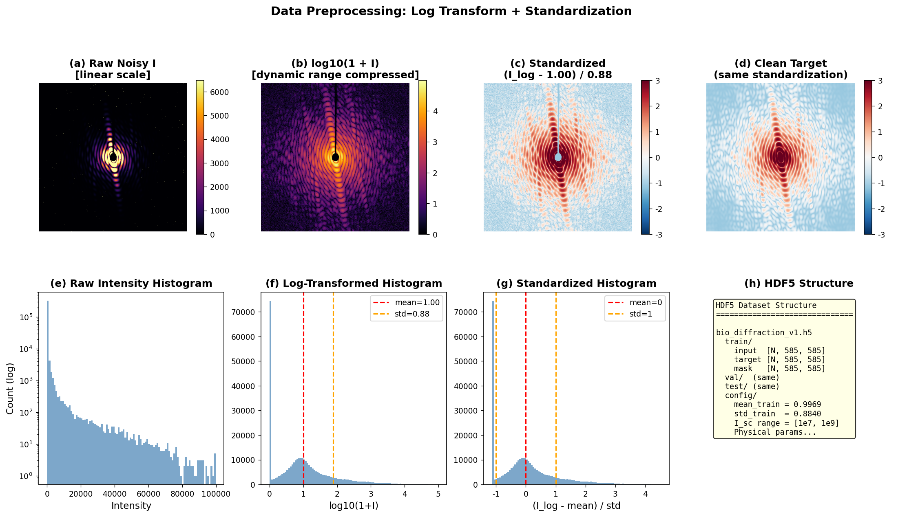

### 9.4 数据生成命令

```bash
# 小规模测试 (10 samples, 必须先运行)
cd tests/bio_diffraction_simulator
python test_small_sample.py --num_samples 10 --output_dir ./test_output

# 完整数据集生成
python generate_dataset.py \
    --num_train 10000 \
    --num_val 1000 \
    --num_test 1000 \
    --output_file ./bio_diffraction_v1.h5 \
    --seed 42
```

### 9.5 物理验证

Pipeline运行前自动执行物理验证：

| 验证项 | 检查内容 | 结果 |
|--------|---------|------|
| FOV一致性 | $4096 \times 15\mu\text{m} = 585 \times 105\mu\text{m}$ | PASSED |
| 采样定理 | 网格尺寸 $\geq$ 256, FOV $\geq$ 1cm | PASSED |
| 强度非负 | $I_{\rm clean} \geq 0$ | PASSED |
| 归一化正确 | $\sum I_{\rm norm} = 1$ | PASSED |
| 值域检查 | $0 \leq \rho \leq 1$ | PASSED |

### 9.6 代码模块依赖关系

```
generate_dataset.py          ← 主入口
├── config.py                ← 全局配置 & 物理验证
├── bio_sample_generator.py  ← E. coli 2D密度图
├── data_augmentor.py        ← 旋转/平移/缩放
├── diffraction_simulator.py ← FFT衍射模拟
├── intensity_normalizer.py  ← 强度归一化
├── random_mask_applier.py   ← 探测器缺陷模拟
├── noise_beamstop_applier.py← 噪声+beamstop
├── utils.py                 ← 可视化/验证/预处理
└── src/physics/noise_model.py ← Poisson-Gaussian噪声模型
```

---

## 10. 总结与展望

### 10.1 已完成工作

| 工作内容 | 状态 | 说明 |
|---------|------|------|
| 实验数据噪声标定 | ✅ | 分析了E. coli实验数据的背景噪声，确定了 $I_{\rm sc}$ 参数范围 |
| E. coli形态学建模 | ✅ | 三种细胞状态 + 内部结构 + 表面噪声 |
| FFT衍射模拟 | ✅ | 与SXFEL实验参数对齐 |
| 噪声模型 | ✅ | Poisson + Gaussian + 探测器缺陷 |
| 样品尺寸确定 | ✅ | 固定 70px 样品尺寸 |
| 完整Pipeline | ✅ | 7步pipeline + 物理验证 + HDF5输出 |
| 数据增强 | ✅ | 旋转/平移/缩放 |

### 10.2 模块特点

- **物理一致性**：所有参数与上海SXFEL实验配置对齐
- **噪声准确性**：噪声参数从实验数据中提取，覆盖高噪声到低噪声场景
- **结构多样性**：三种细胞形态 + 随机内部结构 + 数据增强
- **完整验证**：FOV一致性、采样定理、Poisson统计、值域检查

### 10.3 下一步计划

| 方向 | 说明 |
|------|------|
| 大规模数据集生成 | 生成 ~10,000 训练样本的完整数据集 |
| 深度学习模型训练 | 使用生成的数据训练去噪网络 |
| 实验数据验证 | 将训练好的模型应用于真实实验数据 |
| 3D扩展 | 从2D投影模拟扩展到3D体积模拟 |

---

## 附录

### A. 关键公式汇总

| 公式 | 说明 |
|------|------|
| $I(\mathbf{q}) = \left\|\mathcal{F}[\rho(\mathbf{r})]\right\|^2$ | Fraunhofer衍射强度 |
| $\Delta q = 1/(N \cdot \Delta x)$ | 倒易空间分辨率 |
| $P(k) = \lambda^k e^{-\lambda}/k!$ | Poisson分布 |
| ${\rm SNR} = \lambda/\sqrt{\lambda + \sigma_{\rm read}^2}$ | 综合信噪比 |
| $\text{Var}(D) = 2\mu$ | 背景扣除后的噪声传播 |
| $I_{\rm log} = \log_{10}(1+I)$ | 对数变换 |

### B. 文件清单

```
数据模拟-组会汇报/
├── 数据模拟-组会汇报.md          ← 本报告
├── generate_figures.py            ← 图片生成脚本
├── fig_01_pipeline_overview.png   ← Pipeline总览
├── fig_02_experimental_data.png   ← 实验数据分析
├── fig_03_noise_calibration.png   ← 噪声标定
├── fig_04_cell_states.png         ← 细胞形态
├── fig_05_bio_structure_detail.png← 内部结构细节
├── fig_06_bio_diversity.png       ← 样品多样性
├── fig_07_augmentation.png        ← 数据增强
├── fig_08_diffraction_principle.png← 衍射原理
├── fig_09_size_comparison.png     ← 尺寸对比
├── fig_10_noise_comparison.png    ← 噪声水平对比
├── fig_11_beamstop.png            ← Beamstop mask
├── fig_12_pipeline_complete.png   ← Pipeline示例
├── fig_13_preprocessing.png       ← 预处理流程
└── fig_14_physical_parameters.png ← 物理参数
```

### C. 参考文献

1. "Denoising low-intensity diffraction signals using k-space deep learning" — 噪声模型参考论文
2. Miao, J., et al. "Extending the methodology of X-ray crystallography to allow imaging of micrometre-sized non-crystalline specimens" — CDI方法学基础
3. `src/physics/noise_model.py` — 项目噪声模型实现
4. `参考信息/generate_diffraction_data.py`, `参考信息/pro_diverse_4.py` — 参考3D模拟实现
